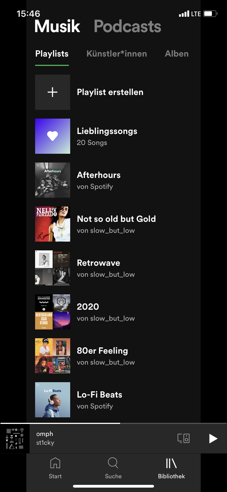

# Project Work - Lezione 1

## Schermata da replicare

## Studio dei Widget necessari

Bisogna ragionare su come comporre il Widget Tree ragionando dal Widget più esterno (arancione) a quello più interno (magenta):

- arancione: NavigationBar
- rosso: TabBar
- giallo: TabBar
- interno al giallo: ListView
- blu: Row (singolo Item della ListView)
- celeste: i due figli della Row
  - Image (dimesione fissa)
  - Column all'interno di un Expanded per farla espandere su tutta la larghezza possibile
- verde: Column (stessa di sopra)
- magenta: i due Text figli della Column

## Esercizio

Provare a fare lo studio dei Widget necessari delle seguenti schermate, poi sceglierne una e svilupparla.

